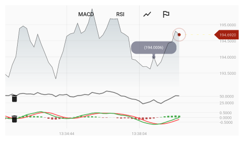
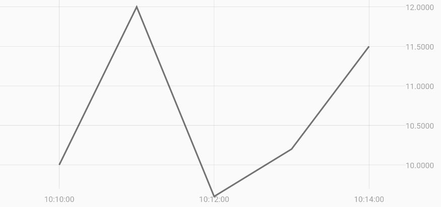
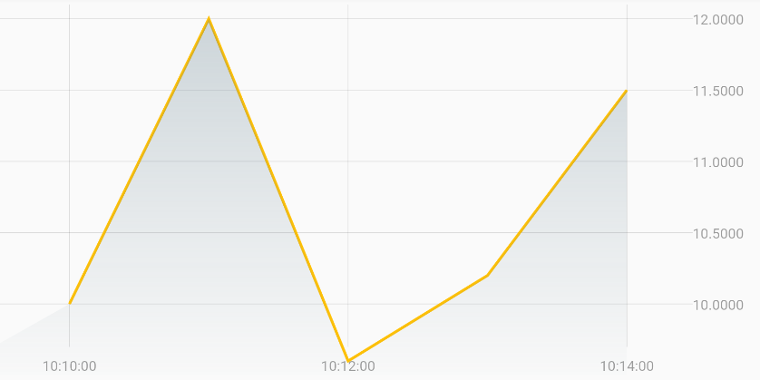
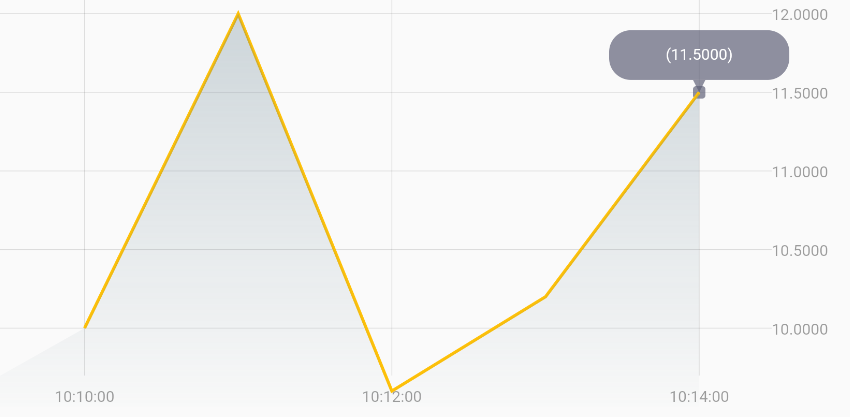
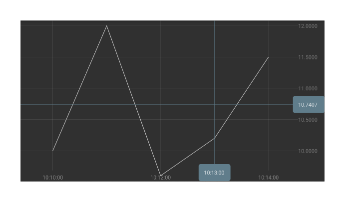

# Flutter Financial Chart

A Flutter package to visualize financial data.



## Getting Started

### 1. Create a simple line chart
A simple line chart:

For charts `x-axis` there are two options:
1. `AbsoluteXAxis`: Uses absolute date values of data entries to align them on x-axis

2. `CategoryXAxis`: Uses the index (order) of data entries hence data entries will be shown with equal distance. (Useful to remove the market gaps.)

```dart
Chart(
      chartId: 'line-chart',
      mainRenderer: LineRenderer(
        DataSeries<TickEntry>.fromList(<TickEntry>[
           DateTimeTick(DateTime(2020, 10, 10, 10, 10), 10),
           DateTimeTick(DateTime(2020, 10, 10, 10, 11), 12),
           DateTimeTick(DateTime(2020, 10, 10, 10, 12), 9.6),
           DateTimeTick(DateTime(2020, 10, 10, 10, 13), 10.2),
           DateTimeTick(DateTime(2020, 10, 10, 10, 14), 11.5),
        ]),
        id: 'line-data',
      ),
      xAxis: CategoryXAxis(),
      yAxis: YAxis(),
    );
```


Add a `AxisConfig`s to axes customize them:
Updating...

##### Other Data Renderers for now
<pre><code>
    1. BarRenderer
    2. OHLCRenderer
    3. CandleRenderer
</code></pre>

##### Defining config for `Renderer`
Can customize the colors of the `Renderer` by giving a `Config` object to it
and specify colors and sizes there.

```dart
lineConfig: LineConfig(
            tooltipConfig: TooltipConfig(),
            color: Colors.amber,
            hasArea: true,
            thickness: 2,
          )),
```



### 2. Enabling tooltip

Give the `LineRenderer` a `config` and enable tooltip there:

```dart
Chart(
      mainRenderer: LineRenderer(
        ...
        lineConfig: LineConfig(tooltipConfig: TooltipConfig())),
      ),
      ...
    );
```



### 3. Adding CrossHair behaviour

Define a `CrossHairBehaviour` to chart's `behaviours` param

```dart
Chart(
      ...
      behaviors: [
        CrossHairBehavior(config: CrossHairConfig(hasTimeLabel: true))
      ],
      ...
    );
```



### 4. Live update
Just keep a reference on the `DataSeries` given to the `Renderer` and  
update the chart widget. The chart will animate in the new data.

```dart
Chart(
          ...
          mainRenderer: LineRenderer(
            _dataSeries,
            ...
          ),
          ...
        )
        
 ...
 
 IconButton(
            icon: Icon(Icons.add),
            onPressed: () => setState(() {
              _dataSeries
                  .add(DateTimeTick(DateTime(2020, 10, 10, 10, 15), 12.5));
            }),
          )
...
```
### 5. Current tick indicators label
Updating example...
### 6. Connecting multiple charts to each other
To connect multiple charts to each other so their x-range zoom and scroll be synced:
1. Create an object of `SharedRange`:

```dart
final _sharedRange = SharedRange();
```

2. Give the same `SharedRange` created to the charts:
```dart
Chart(
      chartId: 'chart_1',
      sharedRange: _sharedRange,
      
...

Chart(
      chartId: 'chart_2',
      sharedRange: _sharedRange,
```

**NOTE**: Charts must have the same type of `x-axis`

To connect the charts `CrossHair` functionality, one chart must be the main chart.

1. Create an object of `PositionNotifier`:
```dart
final _positionNotifier = PositionNotifier();
```

2. Give it as `positionNotifier` to the main chart and as `positionListener` to the
   other charts:
```dart
Chart(
      chartId: 'main_chart',
      positionNotifier: positionNotifier,
      
...

Chart(
      chartId: 'other_chart',
      positionListener: positionNotifier,
```

### 7. Technical indicators
1. For adding technical indicator which their y-axis scale is the same as the main chart
   We can add them by and more renderers to the chart's `renderers param

2. For adding indicator with different y-axis scale than the main chart we should
   connect them via a `SharedRange`.

Updating...

Available indicators for now:
- SMA (Simple Moving Average)
- MACD (Moving Average Convergence Divergence)
- RSI (Relative Strength Index)

### 8. Adding data markers
updating...
### 9. Road map
- Polishing the painting part
- More control for customizing colors and sizes through `configs`
- More technical indicators

